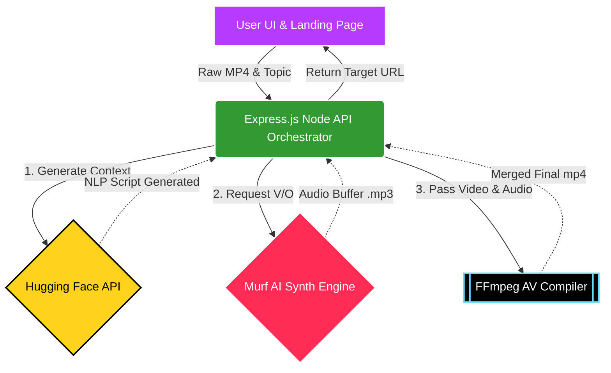

<div align="center">
  
  
  <br />
  
  ### 🎙️ Instantly Write, Generate, and Sync Studio Voiceovers to Videos.
  
  [](https://reactjs.org/)
  [](https://vitejs.dev/)
  [](https://tailwindcss.com/)
  [](https://nodejs.org/)
  [](https://expressjs.com/)
  <br />
  [](https://huggingface.co/)
  [](https://murf.ai/)
</div>

---

## 📖 About Voxify
**Voxify** is a production-ready, full-stack enterprise SaaS web application that fundamentally transforms video content creation. By dragging and dropping an MP4 file, users leverage state-of-the-art Natural Language Processing combined with hyper-realistic AI Speech Synthesis to automatically generate perfectly timed, studio-grade voiceover tracks natively baked into the video. 

Gone are the days of manually scripting, recording endless retakes, matching audio lengths, and rendering in heavy software. 

---

## ✨ Key Features

- **🚀 Interactive SaaS Dashboard**: A premium, dark-themed user interface running on Framer Motion and Shadcn patterns. Includes a Pong-style interactive hero background.
- **🧠 Intelligent Script Generation**: Harnesses **Hugging Face** to analyze your topic and instantly write a compelling context-aware voiceover script perfectly matching the video's pacing.
- **🎭 Customizable Tones & Voices**: Pick between *Professional, Excited, Storytelling, YouTube, Ad, or Documentary* tones. Utilizes **Murf AI** to provide neural-net voices in English and Hindi for both male and female profiles.
- **⚙️ Automated Audiovisual Processing**: Built-in backend **FFmpeg** engine autonomously maps, merges, and perfectly syncs the newly generated audio buffer over the uploaded video.
- **⚖️ Side-by-Side Review**: Immediate A/B interactive HTML5 video players to compare the original raw footage to the new AI-powered production.

---

## 🏗️ System Architecture

Voxify embraces a decoupled client-server architecture. The frontend serves as an ultra-fast static SPA while the Node.js backend operates as a dynamic orchestration layer communicating simultaneously with LLMs, Voice Synthesis logic, and machine-level compiling tools.



### 🔄 Project Workflow

1. **Upload Phase**: The user interacts with the React frontend, dragging an `.mp4` video into the drop zone and specifying a script context and language. 
2. **Proxy Phase**: The Node.js Express server catches the `multipart/form-data`, securely buffering the raw video to a persistent `/uploads` cache.
3. **Data Generation Phase (NLP)**: The backend invokes the Hugging Face `Qwen` models, instructing them (via strict strict character-count limits) to write a script that physically fits the length of the video entirely. 
4. **Synthesis Phase (TTS)**: The finalized text is piped strictly into the Murf AI REST API. The cloud engine calculates realistic neural inflection and returns an Audio URL stream.
5. **Compilation Phase (AV)**: The Express server boots a child-process instance of `ffmpeg-static`. It strips any existing audio tracks from the original video, overlays the new AI voice, bounds the timescale to avoid desyncs, and exports a final physical `.mp4` into the payload directory.
6. **Delivery Phase**: Client frontend consumes the finalized video URL and dynamically switches from the processing loader to the interactive A/B player viewport.

---

## 🛠️ Technology Stack

### **Frontend Client**
- **Framework**: React.js 18 + Vite (ESM)
- **Styling**: Tailwind CSS V3, Vanilla CSS variables
- **Animations**: Framer Motion
- **Architecture Patterns**: Custom React Hooks (`useVoiceover.js`), Glassmorphism DOM nodes
- **Networking**: Axios (with custom `getServerUrl()` routing interceptors)

### **Backend Server**
- **Runtime**: Node.js (v18+)
- **Server**: Express.js
- **Media Engine**: `fluent-ffmpeg`, `ffmpeg-static`, `ffprobe-static` (Platform agonizing compilation)
- **FileSystem**: `multer` API limits and temporary local file management
- **Machine Learning**: `@huggingface/inference` (Direct model invocation)
- **Text-to-Speech**: Native REST wrappers for Murf AI services.
- **Resilience**: Custom Timeout wrappers to bypass API proxy Socket Hangups (`ECONNRESET`).

---

## 🚀 Local Development Setup

To test Voxify dynamically on your own local machine, follow the checklist below:

### 1. Prerequisites
- **Node.js** v18+ running on Windows, MacOS, or Linux.
- **Hugging Face Token**: [Get your key here](https://huggingface.co/settings/tokens) (Ensure you enable `Make calls to Inference Providers`).
- **Murf AI Key**: [Get your key here](https://murf.ai/resources/api).

### 2. Fork and Clone
```bash
git clone https://github.com/your-username/voxify.git
cd voxify
```

### 3. Backend Setup
Initiate the server side logic.
```bash
cd backend
npm install
```
Duplicate `.env.example` into a new file named `.env` and fill out your secrets:
```env
PORT=5000
FRONTEND_URL=http://localhost:5173
HUGGINGFACE_API_TOKEN=your_hf_token_here
MURF_API_KEY=your_murf_api_key_here
```
Boot the orchestrator:
```bash
npm run dev
# Running concurrently on PORT 5000
```

### 4. Frontend Setup
In a totally separate terminal pane:
```bash
cd frontend
npm install
```
Ensure your Environment Variables are mapped to your backend in `.env`:
```env
VITE_API_URL=http://localhost:5000/api
```
Boot Vite:
```bash
npm run dev
# VITE is running on http://localhost:5173 
```

### 5. Start Hacking
Visit `http://localhost:5173` on your browser! The site is fully functional offline locally as long as the API keys resolve cleanly.

---

## ☁️ Deployment

Voxify separates its build targets for maximum efficiency. Follow the detailed [Deployment Instructions](DEPLOYMENT.md).
- **Frontend** should deploy optimally on **Vercel** (`npm run build`).
- **Backend** should deploy to **Render** Web Services natively, with automatic static binaries initialized for `FFmpeg`.

---

## 📄 License
This application is completely open-sourced manually configured under the **MIT License**. Check the LICENSE document natively in the repository for broad-scope distribution guidelines.
